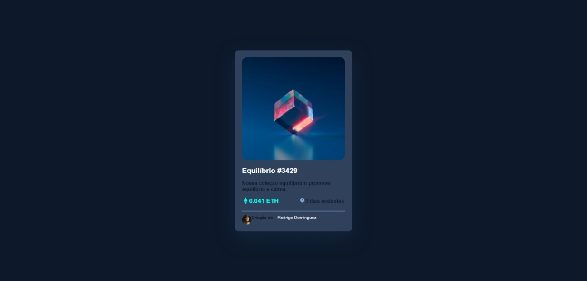

# Frontend Mentor - solução de componente de cartão de visualização NFT
Esta é uma solução para o [desafio do componente de cartão de visualização NFT no Frontend Mentor](https://www.frontendmentor.io/challenges/nft-preview-card-component-SbdUL_w0U). Os desafios do Frontend Mentor ajudam você a melhorar suas habilidades de codificação criando projetos realistas.

## Índice

- [Visão geral](#visão geral)
  - [O desafio](#the-challenge)
  - [Captura de tela](#captura de tela)
- [Meu processo](#meu-processo)
  - [Construído com](#construído com)
  - [O que aprendi](#o-que-aprendi)
  - [Desenvolvimento contínuo](#desenvolvimento contínuo)
  - [Recursos úteis](#useful-resources)
- [Autor](#autor)
- [Agradecimentos](#agradecimentos)

## Visão geral

### O desafio
Meu desafio foi realmente posicionar os elementos da maneira correta.

### Captura de tela

## Meu processo
Desenhei em um papel colocando as tag, class e tudo que fosse ser usado no html para ter uma base do que seria escrito e depois estilizar no css.
### Construído com

- Marcação HTML5 semântica
- Propriedades personalizadas de CSS
- Discplay flex
- Positio absolute

### O que eu aprendi
Use esta seção para recapitular alguns de seus principais aprendizados ao trabalhar neste projeto. Escrevê-los e fornecer amostras de código das áreas que você deseja destacar é uma ótima maneira de reforçar seu próprio conhecimento.
Para ver como você pode adicionar snippets de código, veja abaixo:

Me orgulho de todo código escrito.

### Desenvolvimento contínuo
Pretendo focar no css para conseguir manejar melhor as parte de posicionamento dos elementos.

### Recursos úteis

- O que me ajudou foi um projeto que fiz na semana passada de uma calculadora que fiz em uma aula com o Gustavo Nesk do youtube.

## Autor

- Linkedin - www.linkedin.com/in/rodrigo-l-dominguez
- Mentor Frontend - (oculto)
- GitHub - https://github.com/Rodrigo2811/Rodrigo2811

## Agradecimentos
Agradeço ao video do Gustavo Nesk.